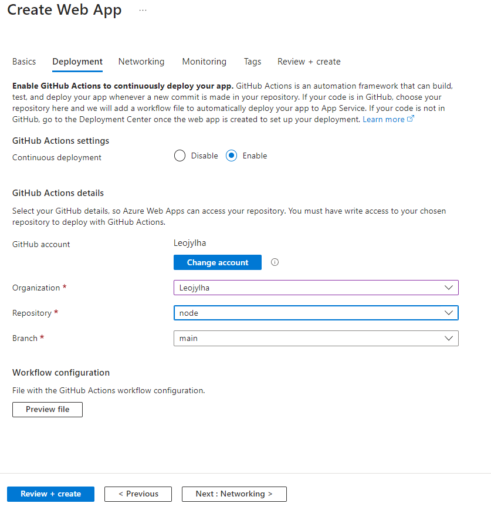
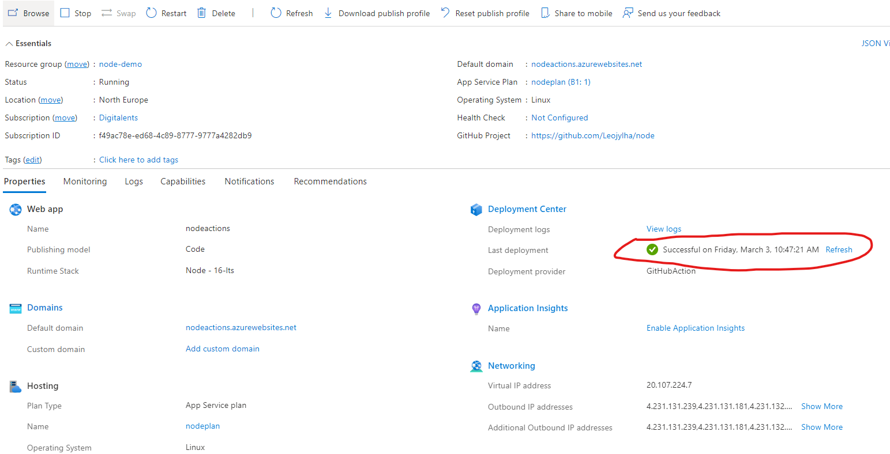

# Sovelluksen toimituksen automatisointi Githubista Azureen

- [Ohje](#ohje)
- [1. Johdanto](#1-johdanto)
- [2. Portal](#2-portal)
- [3. App Servie Plan](#3-app-service-plan)
- [4. Web App](#4-web-app)
- [5. Linkit](#5-linkit)

## Ohje

Dokumentin tarkoitus: Opastaa henkilökuntaa Azuren käytössä

Dokumentin on laatinut: Leo Jylhä

Päivitysvastuu: ICT-tiimi

## 1. Johdanto

Tarkoituksena saada sovelluksen toimitus automatisoitua, jolloin aina githubissa main branchia päivittäessä, päivittyy sovellus Azuressa. 

Tässä esimerkissä on käytetty simppeliä Node.JS sovellusta.

***Huom!***

Tarkista, että sinulla on käyttöoikeudet repositoryyn ja ettei repositoryssa ole workflow tiedostoja.

## 2. Portal

Luodaan resurssiryhmä, app service plan ja web app.

Kirjoita hakukenttään "Resource groups" ja valitse Create.

Varmista, että subscription kohdassa lukee Digitalents.

Anna ryhmällesi nimi ja valitse sijainniksi North Europe.

Anna resurssi ryhmällesi 4 tagia.
- luonut: etu ja sukunimi
- käyttäjä: etu ja sukunimi
- tiimi: kohdetiimi
- luotu kk.vvvv

Valitse Review + Create.

## 3. App Service Plan

Kirjoita hakukenttään "App service plan" valitse ensimmäinen ja paina Create.

Aseta seuraavat tiedot:

- Subscription: Digitalents
- Resource Group: Tekemäsi resurssiryhmän nimi
- Name: App Service Planin nimi
- Operating System: Linux
- Region: North Europe
- Pricing plan: Free F1/Basic B1, riippuen sovelluksen koosta ja vaativuudesta.
- Zone redundancy: Disabled
  Valitse Review + Create

## 4. Web App

Kirjoita hakukenttään "App services" ja valitse ensimmäinen. Valitse Create.

Aseta seuraavat tiedot:

- Subscription: Digitalents
- Resource Group: Tekemäsi resurssiryhmän nimi
- Name: Web sovelluksesi nimi
- Publish: Code
- Runtime stack: Käyttämäsi kieli
- Operating System: Linux
- Region: North Europe
- Linux Plan: Tekemäsi planin nimi

Valitse Next: Deployment

Aseta seuraavat tiedot:

- Continuous deployment: Enable
- Github account: Valitse käyttäjäsi
- Organization: Organisaatiosi
- Repository: Repository, josta haluat koodin toimittaa.
- Branch: main

Valitse Review + Create.

Deployment Center ilmoittaa kun deployment on valmis ja automaatio toimii. Tässä menee yleensä muutama minuutti.

Testataan automaatiota.
Vaihdetaan Hello World teksti Hello Virittämö.

Teksti päivittyy palvelimelle muutamassa minuutissa

## 5. Linkit

[Github Actions Docs](https://docs.github.com/en/actions)

[App Service Docs](https://learn.microsoft.com/en-us/azure/app-service/)
