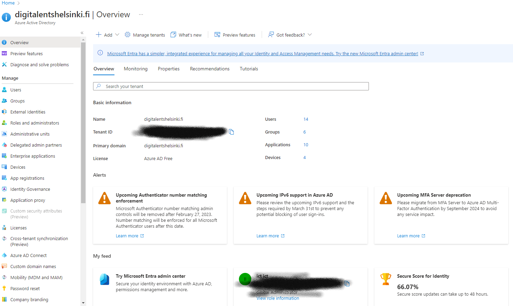

# Azure Active Directory

Azure Active Directory(AAD) on Microsoftin pilvipohjainen identiteetin ja käyttöoikeuksien hallinta järjestelmä. Azure Active Directory kuuluu nykyään osaksi Microsoft Entra tuoteperhettä, mutta tässä dokumentissa ei perehdytä siihen. Yleensä puhuttaessa Azure Active Directorysta monille tulee mieleen perinteinen Active Directory, näissä kumminkin on eroavaisuuksia joihin keskeisimpiä ovat mm.
-  AAD ei vaadi palvelinta, jossa pyörii Windows Server vaan se toimii täysin pilvestä eikä vaadi palvelinta toimiakseen.
- Perinteinen AD toimii yhtiön verkon sisältä tai VPN-yhteyden kautta, pilven ansiosta AAD  toimii lähes kaikkialla jossa on internetyhteys.

***Hyödyt***

1. SSO eli Single Sign-On mahdollistaa samoilla käyttäjätunnuksilla kirjautumisen eri palveluihin, eli kirjautuessa ei tarvi huolehtia käyttäjätunnuksista vaan AAD hoitaa tämän puolestasi. Esim. Teams, Outlook ja Sharepoint.

2. AAD:n avulla voidaan saada tietoa, kuka kirjautuu, mihin kirjautuu, mistä kirjautuu ja milloin kirjautuu, eli AAD kerää automaattisesti statistiikkaa käyttäjien kirjautumisista. Tämän avulla tietoturva paranee ja epäillyttävissä kirjautumistilanteissa voidaan käyttö estää.

3. MFA eli Multi Factor Authetication tarkoittaa monivaiheista tunnistautumista. Käyttäjätunnuksien lisäksi voidaan esimerkiksi pyytää käyttäjää hyväksymään kirjautumispyyntö mobiililaitteesta löytyvällä Microsoftin omalla Authenticator sovelluksella. Tämä varmistaa käyttäjille turvallisen kirjautumisen ja identiteetin varmistamisen.
   
4. AAD on integroitavissa myös omaan Active Directoryyn ja omiin sovelluksiin, Esim. kehittäjät haluavat kehittämällen sovellukselle helpon ja turvallisen tunnistautumismuodon, AAD tarjoaa tähän lukuisia ohjelmointirajapintoja(API) joiden avulla AAD:n integrointi sovellukseen on helppoa ja tehokasta.
   
5. AAD täyttää tarkat kriteerit ja standardit tietoturvan, yksityisyyden ja yhteensopivuuden osalta. Azurella onkin eniten sertifikaatteja kaikista pilvipalveluntarjoajista tältä saralta mm. ISO/IEC, CSA/CCM ja CJIS.
   

***Lisenssit***

AAD on saatavilla neljässä eri versiossa:

1. Free
2. Office 365 apps
3. Premium P1
4. Premium P2

Free versio sisältää vain perustyökalut AAD:n käyttöön, tämä versio on meillä Virittämöllä käytössä, kun taas Premium P2 joka näistä on kallein, sisältää kaikki saatavilla olevat ominaisuudet ja työkalut. Tässä dokumentissa ei perehdytä enempää lisenssiasioihin, lisätietoa niistä löydät [täältä.](https://azure.microsoft.com/en-us/pricing/details/active-directory/)

***Käyttö***

AAD:n löydät Azuren portaalista syöttämällä hakukenttään "Active Directory"

Yleisnäkymä

Täältä löydät kaikki työkalut AAD:n hallintaan mm.

- Käyttäjien, ryhmien ja sovellusten hallinta
- Lisenssit
- Liitetyt laitteet
- Roolit
  
  AAD varoittaa myös tulevista päivityksistä ja muutoksista, jotka saattavat mahdollisesti vaatia toimenpiteitä tietoturvan ylläpitämiseksi.

  Security Score analysoi ja käy AD:si läpi ja arvioi mahdolliset haavoittuvuudet, jonka jälkeen se antaa vinkkejä miten nämä voidaan korjata.

Tässä oli yleiskatsaus Azuren Active DIrectoryyn. Lisää tieto aiheesta saat [täältä.](https://learn.microsoft.com/en-us/azure/active-directory/)
