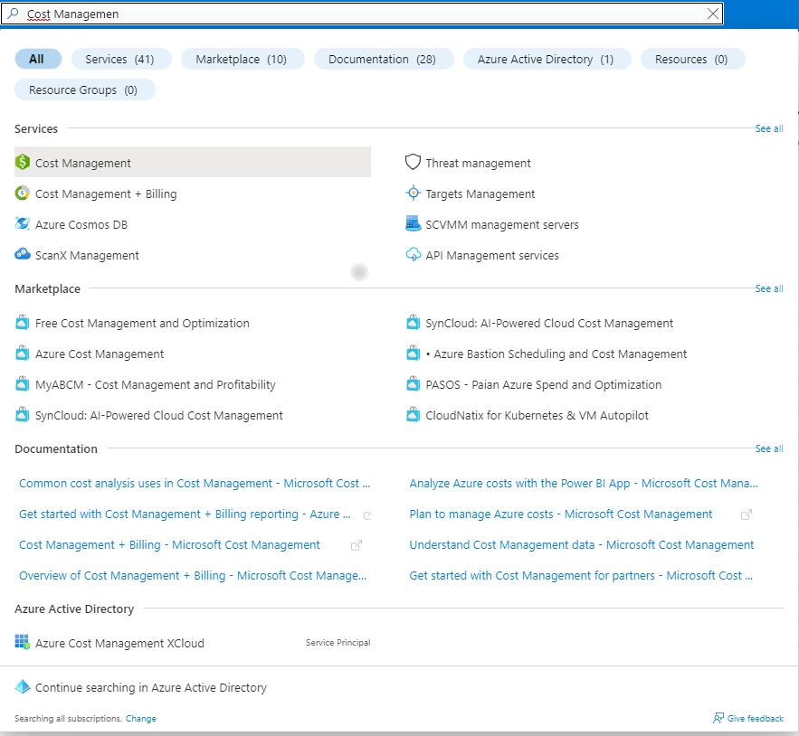
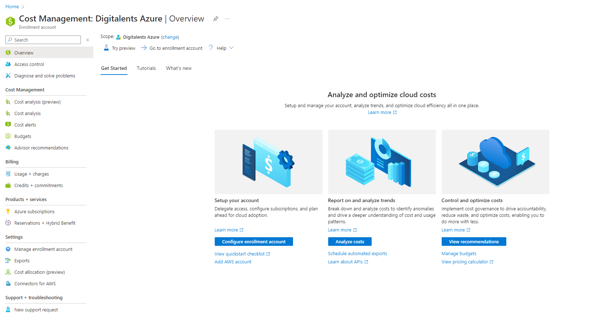
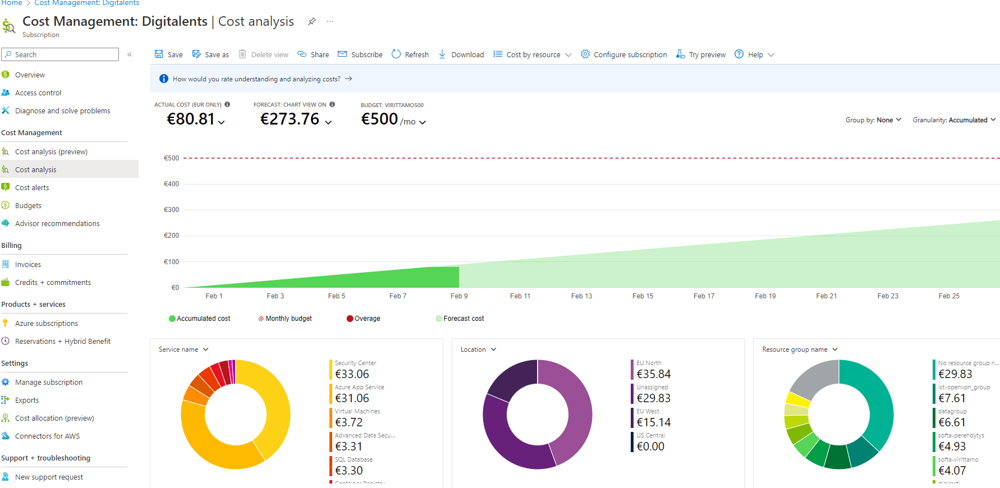
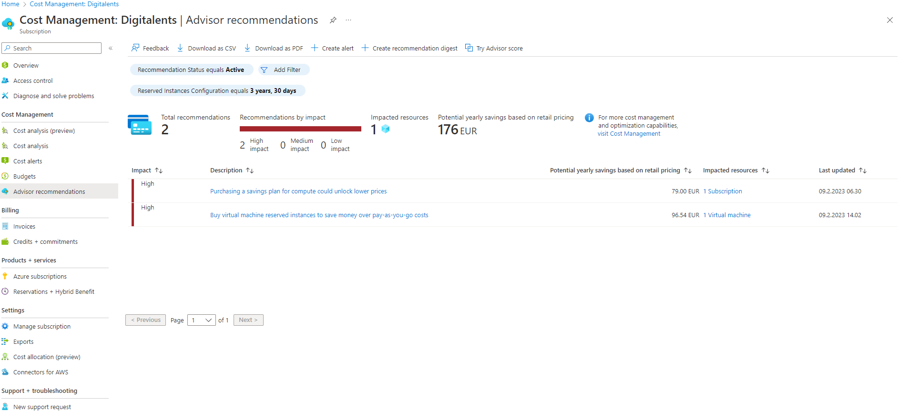
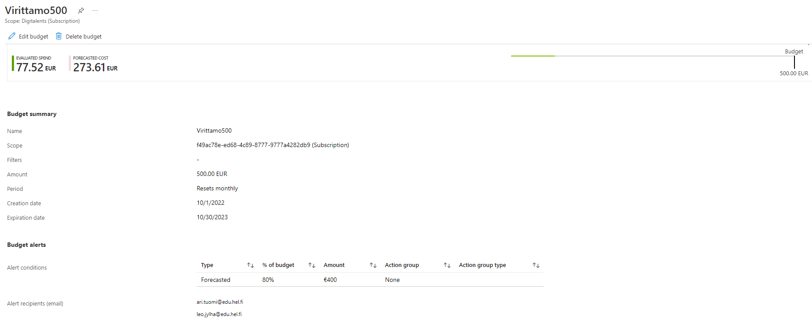

# Cost Management

Jos mietit miten ihmeessä pysyt perillä kaikista juoksevista kuluista Azuressa, miten laskutus toimii, entäs kulujen optimointi?

Mulla on sulle vastaus: *Cost Management*

Cost Management on työkalu Azuressa, joka tarjoaa kaiken liittyen kulujen hallintaan,  monitorointiin ja optimointiin.

***Käyttö***

Cost Managementtiin pääset käsiksi Azuren portaalin kautta kirjoittamalla hakukenttään "Cost Management"

Täältä löydät kaiken tarvittavan kuluihin liittyen.

Valitse Cost Analysis

Cost Analysis kertoo sinulle tietoa kulutuksestasi ja antaa arvion myös kertyvistä kuluista. Kuluja pystyt seuraamaan Subscription kohtaisesti, Resource Group kohtaisesti tai vaikka vaan resurssi kohtaisesti.

***Kulujen optimointi***

Valitse Advisor recommendations

Azuren Advisor antaa sinulle ehdotuksia kulujen optimoimisesta ja kertoo summan, jonka voit toimenpiteiden avulla säästää. Esimerkiksi tässä Advisor on analysoinut kulumme ja ehdottaa, että varaisimme virtuaalikoneelle varatun instanssin pidemmäksi aikaa, koska se on ollut jo kauan yhtäsoittoa päällä. Lopputuloksena on pienemmät kulut.

***Budjetti***

Budjetin asettaminen, tämä on mielestäni tärkeimpiä asioita kulujen hallinnassa ja tämä pitäisi tehdä ensimmäisenä kun otetaan Azurea käyttöön. Tämän avulla voidaan välttää kalliita virheitä.

Budjetit löydät valitsemalla valikosta Budgets.

Tässä käyttämämme budjetti Virittämöllä, eli budjetin katto on 500 euroa. Kun tästä täyttyy 80 prosenttia, lähtee valituille henkilöille ilmoitus sähköpostiin. 

Lisätietoa Cost Managementista löydät [täältä.](https://learn.microsoft.com/en-us/azure/cost-management-billing/)
