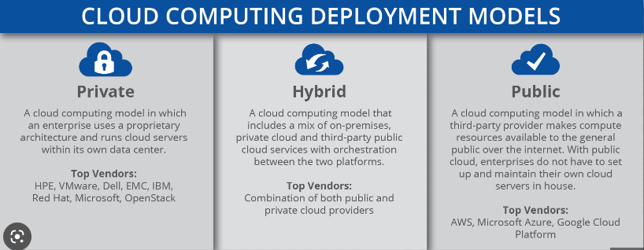
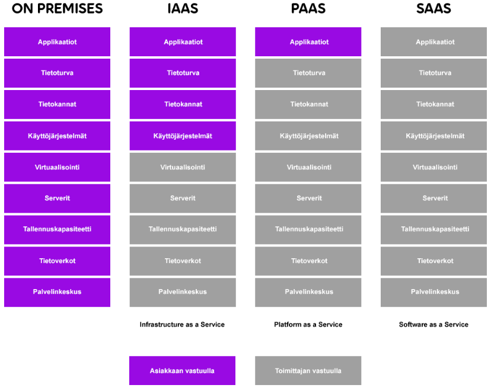

# Pilvi

***Mikä on pilvipalvelu?***

Pilvipalvelu tarkoittaa verkon yli tarjottavia tietojenkäsittely-ja laskentapalveluita. Kun jokin asia sijaitsee pilvessä se ei sijaitse omalla tietokoneellasi, organiosaatiosi palvelimilla vaan palveluntarjoajan palvelimilla. Kun käytämme pilvipalvelua, esimerkiksi Microsoftin Azurea, Microsoft vuokraa meille resursseja ja kapasiteettia.

***Pilvien jaottelu***

Julkipilvi, Hybridipilvi ja Yksityinen pilvi. Mitä nämä ovat?

Julkipilvi on kolmannen osapuolen ylläpitämiä palveluita ja resursseja joita tarjotaan verkon välityksellä. Pilvipalveluntarjoaja omistaa ja ylläpitää sovellukset, raudan ja kaiken infrastruktuurin, jota palveluiden pyörittäminen vaatii. Yleisimpiä julkipilven tarjoajia ovat Amazon Web Services(AWS), Microsoft Azure ja Google Cloud Platform(GCP)

Hybridipilvi on kokonaisuus, joka muodostuu eri pilvipalveluiden sekä teknologioiden yhdistelmästä. Esim. julkipilven ja yksityisen pilven yhdistäminen. Tämä antaa yritykselle mahdollisuuden hyödyntää molempien pilvien edut tarpeiden mukaan.

Yksityinen pilvi on oraganisaatiolle rakennettu yrityskohtainenpilvipalveluratkaisu. Yksityinen pilvi ei ole saatavilla julkisesta verkosta vaan sitä hallinnoidaan ainoastaan suoraan yrityksen sisäverkosta tai suojattujen etäyhteyksien kautta.

***Palvelumallit***

Pilvestä puhuttaessa ylensä törmää termeihin PaaS, SaaS, IaaS ja Serverless. Mitä nämä ovat?

IaaS eli Infrastructure as a Service tarkoittaa palvelumallia, jossa infrastruktuuria tarjotaas asiakkaalle verkon välityksellä. Tämä vaatii asiakkaalta palvelimien käyttöjärjestelmiin ja pilvi-infrastruktuuriin liittyvää osaamista, koska asiakkaalla on vastuullan infran hallinointi ja konfigurointi sekä sovellusten julkaisu kyseiselle alustalle eli ylläpidettävää on. Esim. Azure Virtual Machines hyödyntää IaaS mallia.

PaaS eli Platform as a Service tarkoittaa sovellusalustaa palveluna ohjemistojen kehittämiseen, testaamiseen ja julkaisuun. Tässä palvelumallissa ylläpitotarpeet ovat palveluntarjoalla toisin kuin IaaS mallissa eli asiakas vastaa vain sovelluksen kehittämisestä ja julkaisemisesta. Esim. Openshift ja Heroku hyödyntää PaaS mallia.

SaaS eli Software as a Service tarkoittaa ohjelmistoa palveluna eli yleensä puhutaan ohjelmistosta, joka on saatavilla selaimen kautta silloin kun sitä tarvitaan. Esim. Microsoft 365, Zoom ja Netflix. SaaS mallissa asiakas vastaa vain itse sovelluksen käytöstä, kaikki muu vastuu on palveluntarjoajalla.

Serverless tarkoittaa mallia, jossa käyttäjällä ei ole dedikoitua palvelinta vaan palvelimelta annetaan resursseja käytön mukaan eli asiakas voi keskittyä sovelluksen kehittämiseen ja ylläpitoon. Esim. Azure Functions hyödyntää serverless mallia.

Vastuunjako

***Pilven hyödyt***

Pilven hyötyjä on lukuisia, mutta tässä ehkä niitä yleisimpiä syitä miksi tänäpäivänä yritykset siirtyyy omista konesaleista pilveen.

1. Kustannustehokkuus eli ei tarvitse sijoittaa enään suuria määriä rahaa omien konesalien pystyttämiseen/ylläpitoon. Pilvessä tarjottavat resurssit tarjotaan Pay-as-you-go mallilla eli maksat vain siitä mitä käytät. Kustannusten seuranta on myös pilvessä helppoa ja tehokasta.

2. Skaalautuvuus eli palvelun tai sovelluksen käytön lisääntyminen ei ole enää sidoksissa oman konesalisi kapasiteettiin vaan saat pilvestä resursseja tarpeesi mukaan. Esim. nettisivujesi käyttäjämäärä räjähtää ja oma palvelimesi ei pysty vastaamaan enää kysyntään, jonka seurauksena nettisivujen käyttö  hidastuu/estyy kokonaan. Jos nettisivut olisivat pilvessä, näin ei kävisi skaalautuvuuden ansiosta. Pilvi tarjoaa resursseja silloin kun nettisivut niitä tarvitsevat ja kun käyttäjämäärä pienenee voidaan vetää ylimääräiset resurssit pois käytöstä.

3. Saatavuus eli palvelusi eivät ole sidottuna yhteen sijaintiin vaan ne on saatavilla aina verkon välityksellä.

4. Tietoturva  eli palveluntarjoajan konesali on todennäköisesti turvallisempi paikka kuin omasi. Tietoturvaa parantavia palveluja löytyy pilvestä lukuisia, myös datan kerääminen ja alusta monitorointi on tehty pilvessä todella tehokkaaksi.

