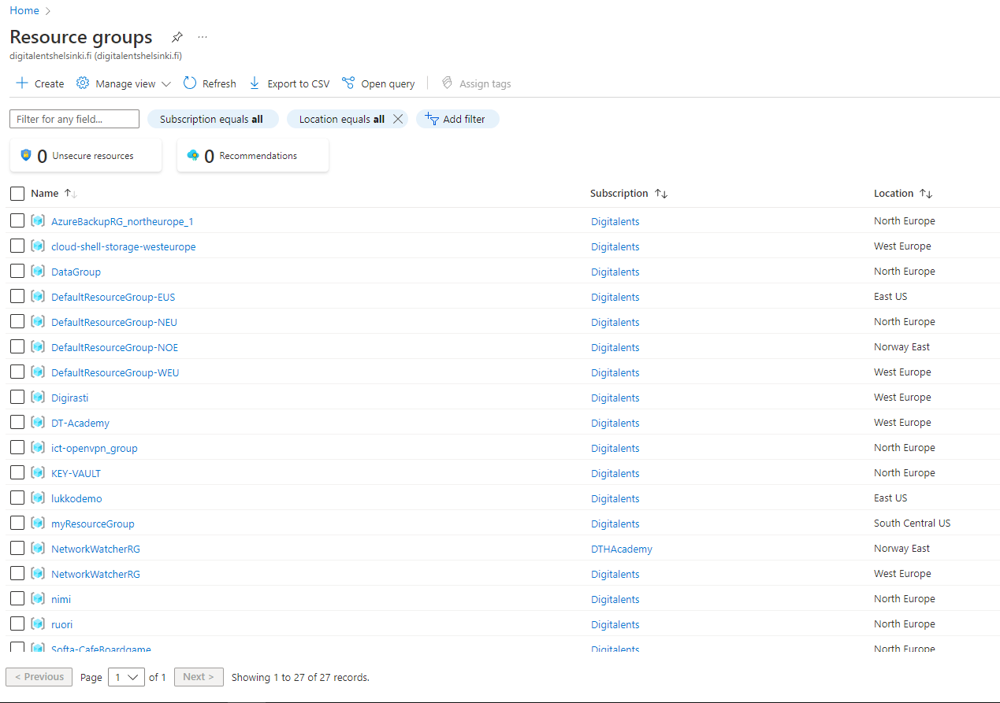
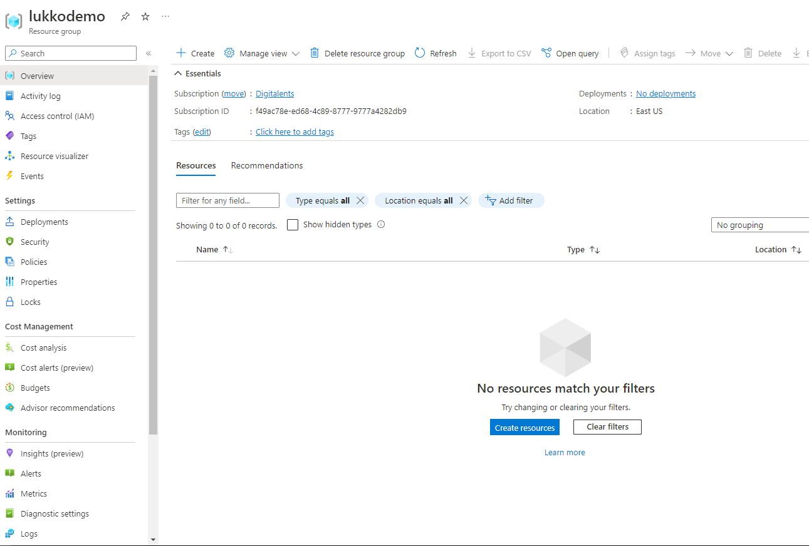
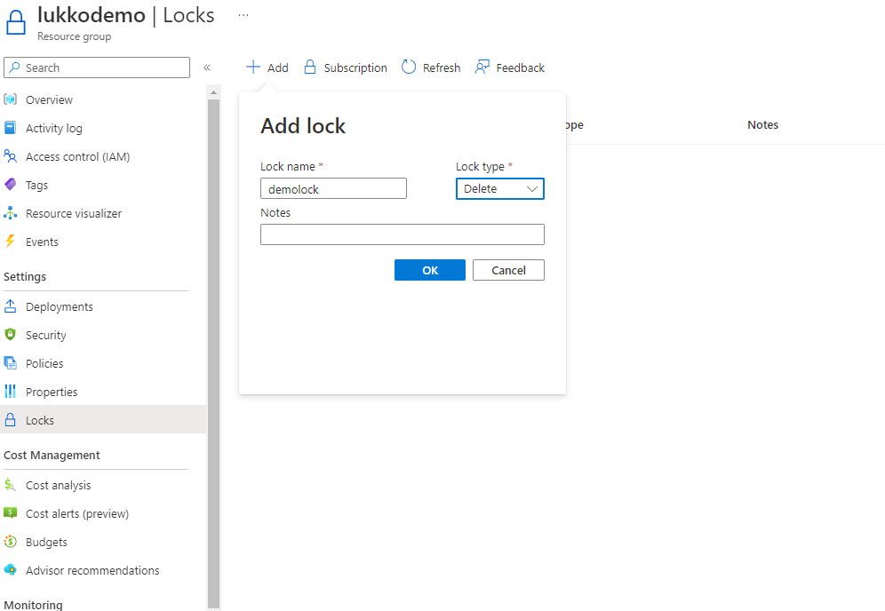

# Resource Locks

Resurssilukot ovat lukkoja, jonka avulla voidaan suojata Azuressa olevia resursseja. Lukkoja on kahta erilaista:

1. Delete lukko, käyttäjät voivat tehdä muutoksia resurssiin muttei poistaa sitä.
2. Read-Only, nimensä mukaisesti käyttäjät voivat tarkastella resurssia muttei tehdä muutoksia.
   
Lukkoja voidaan asettaa subscription, resource-group ja resource tasolla. Lukot yliajavat kaikkien roolien oikeudet.

Vain Owner ja User Access Administrator voivat asettaa lukkoja.

Suosittelen lukitsemaan kaikki tärkeät resurssit Azuressa, ettei vahinkoja pääse sattumaan.

***Esimerkki***

Lukitaan resurssiryhmä

Kirjoita hakukentään "Resource Groups"

Valitse haluamasi resurssiryhmä

Valitse Locks settings kohdasta

Valitse Add, anna lukon nimi, lukon tyyppi ja paina OK.

Jos yrität poistaa resurssiryhmää, saat seuraavanlaisen ilmoituksen

Lisätietoa lukoista löydät [täältä.](https://learn.microsoft.com/en-us/azure/azure-resource-manager/management/lock-resources?tabs=json#who-can-create-or-delete-locks)
