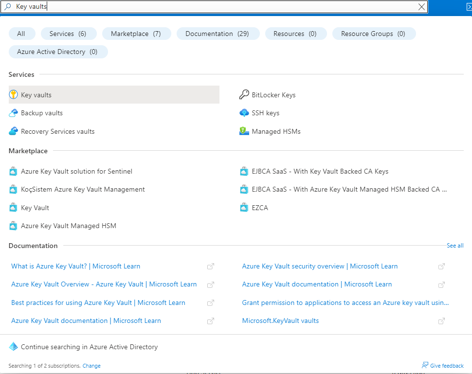
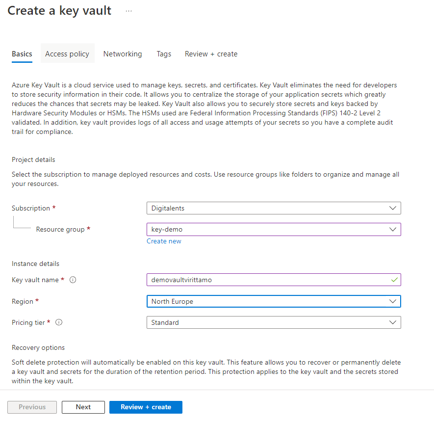
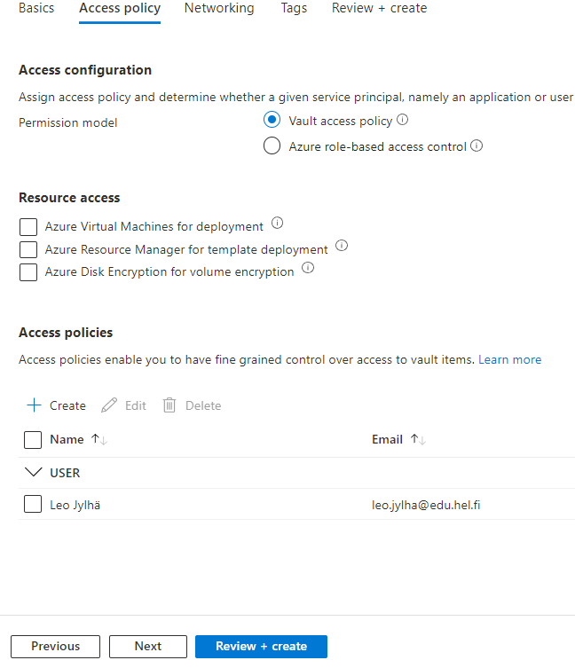
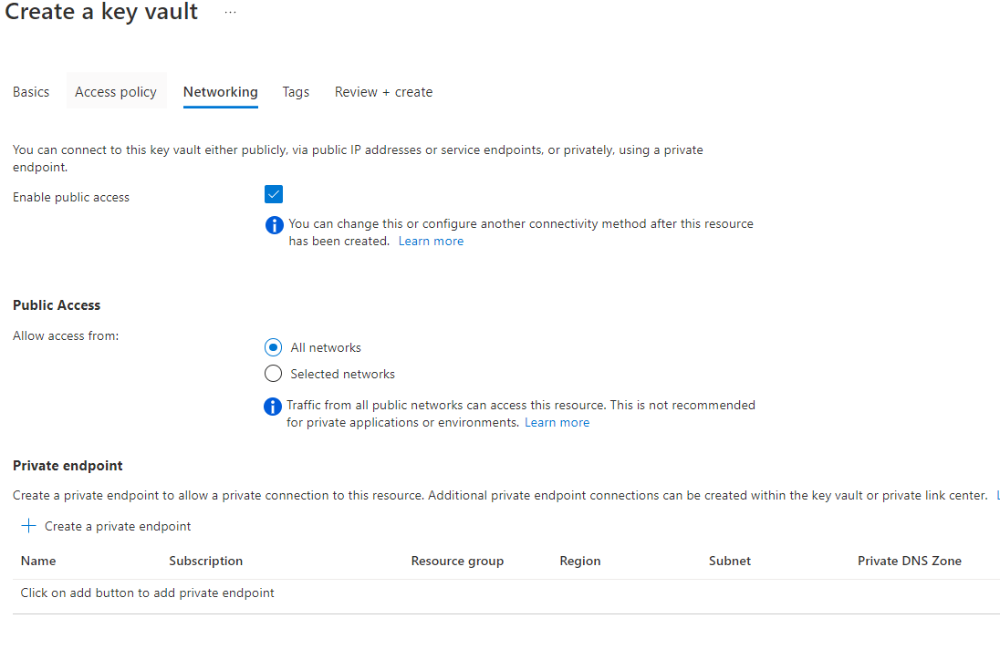

# Key Vault

Azure key vault tarjoaa pilvessä keskitetyn, turvallisen ja skaalautuvan säilytyspaikan tiedoillesi. Esim. pilvipohjaisten sovellusten ja palveluiden käyttämät salasanat, avaimet ja sertifikaatit.

Key Vaultin avulla voit kontrolloida, kuka pääsee avaimiin käsiksi ja milloin. Voit myös monitoroida avainten käyttöä ja asettaa avaimille vanhentumis päivämääriä sekä luoda varmuuskopioita avaimista.

***Hyödyt***

1. Key Vault on helposti integroitavissa muihin palveluihin/sovelluksiin. Esim. Virtuaalikone ja Data Factory käyttävät samaa tietokantaa, Key Vaulttia hyödyntämällä, voidaan jakaa sama avain molemmille palveluille. Seurauksena on korkeampi tietoturva ja parempi käytettävyys.

2. Yhteensopivuus, Key Vault on suunniteltu täyttämään lukuisat alan tietoturvastandardit ja vaatimukset. Esim. SOC, HIPAA ja PCI DSS.

3. Automaatio, Key Vault tarjoaa lukuisia Apeja ja työkaluja avaintenhallinnan automatisointiin ja järjestelmälliseen hallintaan. Avaimia voidaan esimerkiksi integroida CI/CD pipelineihin.

***Käyttö***

Luodaan Key Vault

Kirjoita hakukenttään "Key vaults" ja valitse ensimmäinen, valitse Create.

Aseta seuraavat tiedot:

* Subscription: Digitalents
* Resource group: Haluamasi resurssiryhmä
* Key vault name: Key vaulttisi nimi
* Region: North Europe
* Pricing tier: Standard
* Soft-delete: Enabled
* Days to retain: 90
* Purge protection: Disable

    Paina Next

* Access configuration: Vault access policy
* Resource access: valitse resurssit käyttösi mukaan
* Access policies: lisää käyttäjät, joille haluat oikeudet key vaulttiin ja niille oikeudet.

    Paina Next

* Enable public access: kyllä
* Public Access: All networks
    Paina Review + create

    **HUOM**

    Näissä asetuksissa on huomioitu testi/demotilanne, jos keyvault tulee käyttöön suosittelen määrittämään eri asetukset keyvaultille.

Nyt keyvault on valmiina käyttöön!

Tässä dokumentissa käytiin Keyvaultin perusteet ja vaultin luominen. Lisätietoa aiheesta löydät [täältä.](https://learn.microsoft.com/en-us/azure/key-vault/)

Informatiivinen video [aiheesta.](https://www.youtube.com/watch?v=AA3yYg9Zq9w)
