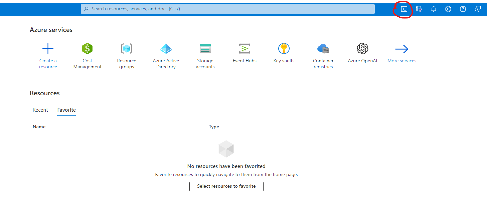
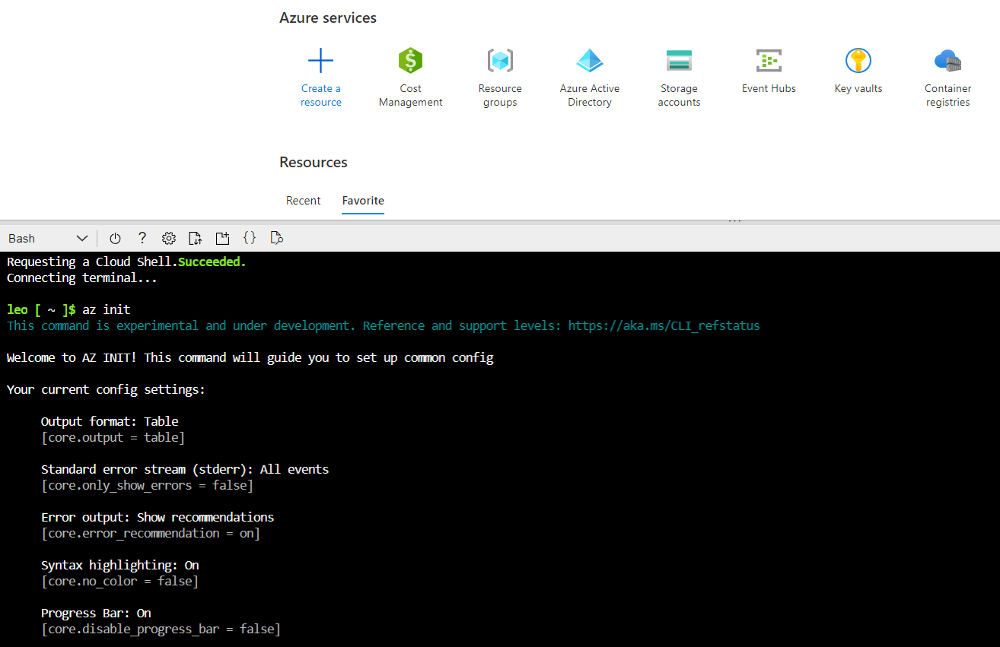
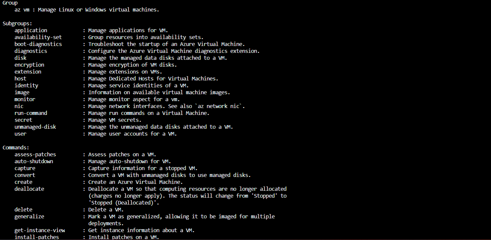
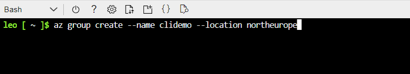
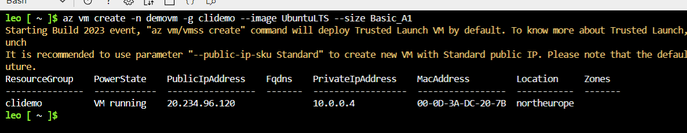
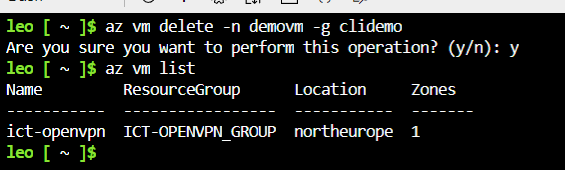

# Azure CLI

Azure CLI eli command-line interface on toinen tapa käyttää Azurea portalin lisäksi. Cli on asennettavissa Windowsille, Linuxille ja Macille. Cli:tä voidaan kumminkin käyttää myös asentamatta sitä omalle tietokoneelle, hyödyntämällä cloud shelliä. Cli tarjoaa siis komentorivin graafisen käyttöliittymän sijaan. Azuren kanssa keskustellaan komentojen ja scriptien avulla. 

***Huom!***

Suosittelen clihin tutustumista vasta kun perusteet Azuren käytöstä on hallusta ja osaat käyttää portalia sujuvasti.

## Cloud Shell

Cloud shellin löydät portalista oikeasta yläkulmasta.

Cloud shell luo käyttöä varten storage accountin, josta koituu pieni kuukausittainen maksu.

Cloud shellissä voit käyttää Powershellia tai Bashia, suosittelen käyttämään Bashia, koska se on simppelimpää, nopeampi oppia ja suurimmassa osassa dokumentaatiota on käytetty Bashia.

Kirjoita aluksi "az init" ja paina 1, tämä konfiguroi shellisi valmiiksi käyttöä varten.

Jos komentorivin käyttö ei ole tuttua, suosittelen käyttämään cloud shellia interaktiivisessa tilassa, tämä tarjoaa esimerkkejä ja apua clin opetteluun. Interaktiiviseen tilaan pääset kirjoittamalla "az interactive".

Clin hyötynä on huomattavasti nopeampi käyttö, esim. tiedonhaku, resurssien luominen tai konfiguroiminen tapahtuu todella nopeasti verrattuna portalin käyttöön. Scriptien ja muuttujien avulla voidaan komentojen käyttö automatisoida, niitä ei tässä dokumentissa kumminkaan käsitellä.

Apua komentojen suorittamiseen löydät kirjoittamalla --help.

Esim. halutaan luoda virtuaalikone, muttei tiedetä komentoa sille. Kirjoitetaan "az vm --help"

Komento tarjoaa apua ja antaa vaihtoehtoja selityksien kanssa.

Luodaan resurssiryhmä ja virtuaalikone.

Annetaan resurssiryhmälle nimi ja sijainti

Tarkistetaan, että resurssiryhmä on luotu

Luodaan virtuaalikone

Näin helppoa on virtuaalikoneen luonti clin avulla, portalia käyttämällä tässä olisi mennyt huomattavasti pidempi aika, nyt syötin vain muutaman komennon. Poistetaan virtuaalikone vielä lopuksi. 

## Linkit

[Informatiivinen video aiheesta.](https://www.youtube.com/watch?v=AzQTkl06D-Y)

[Cli docs](https://learn.microsoft.com/en-us/cli/azure/)

[CLi asennus](https://learn.microsoft.com/en-us/cli/azure/install-azure-cli)
