 <h1>Sovelluksen siirtäminen Azuren App Serviceen</h1>

- [Ohje](#ohje)
- [1. Johdanto](#1-johdanto)
- [2. Image](#2-image)
- [3. Portal](#3-portal)
- [4. Resurssit](#4-resurssit)
- [4.1 Resource Group](#41-resource-group)
- [4.2 App Service Plan](#42-app-service-plan)
- [4.3 Web App](#43-web-app)
- [5. Logs](#5-logs)
- [6. Linkit](#6-linkit)
  

## Ohje

Dokumentin tarkoitus: Opastaa henkilökuntaa Azuren käytössä

Dokumentin on laatinut: Leo Jylhä

Päivitysvastuu: ICT-tiimi

Tarvitset: Käyttäjä Azuressa, Visual Studio Code, Azure Tools lisäosa, perustietämys Dockerista

## 1. Johdanto

Tarkoituksena toimittaa Dockerisoitu sovellus Azuren App Serviceen.

Tässä esimerkissä on käytetty simppeliä Node.Js sovellusta.

## 2. Image

Buildataan sovelluksesta image ja varmistetaan, että containeri pyörii ja sovellus toimii lokaalisti.

Nimeämisessä käytetään Azuren Container Registeryn tunnuksia: virittamo.azurecr.io/nimi

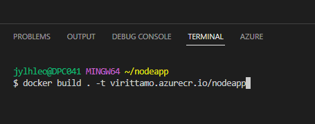

Kun image on buildattu ja container testattu, voidaan se työntää Azuren Container Registryyn.

1. Kirjaudu Azureen sisään komennolla: az login
2. Kirjaudu container registryyn komennolla: az acr login --name virittamo
3. Työnnä image Azureen komennolla: docker push virittamo.azurecr.io/imagenimi
   
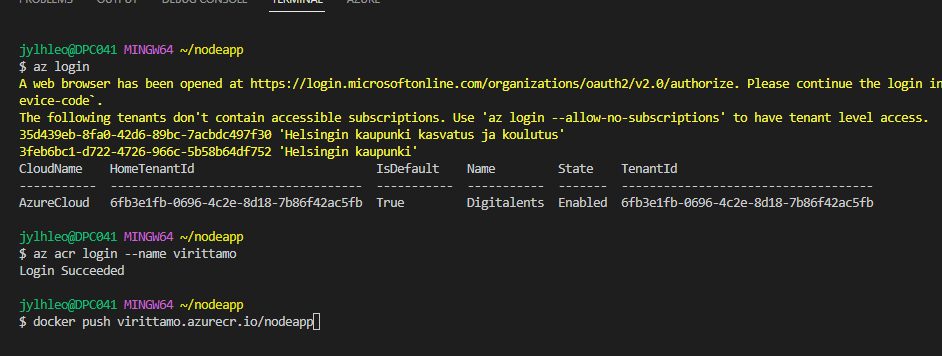

## 3. Portal

Kirjaudu Azure portaliin käyttäjätunnuksellasi ja salasanallasi [tästä.](https://portal.azure.com)

Kirjoita hakukenttään container ja valitse container registries.

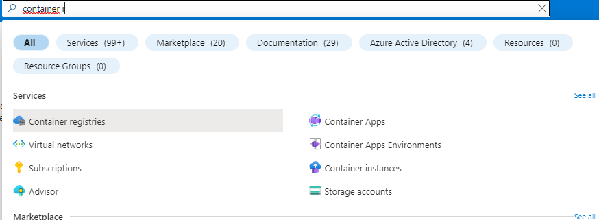

Valitse virittamo ja Repositories. Imagen nimi pitäisi nyt näkyä repositoryssa.

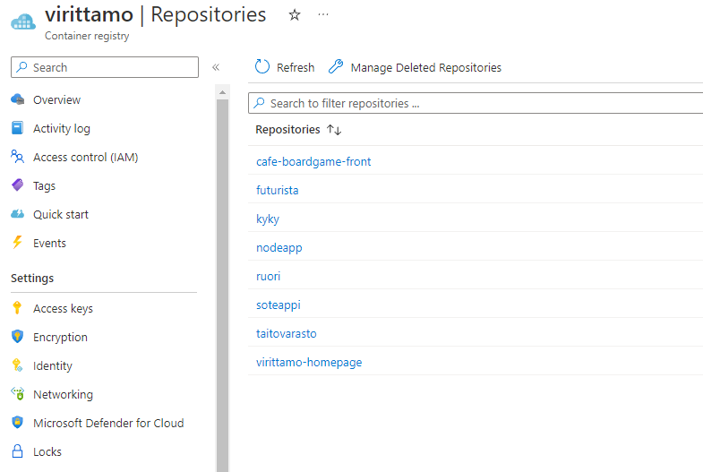

## 4. Resurssit

Nyt kun image on Azuressa, voidaan luodaa sovellukselle tarvittavat resurssit.

Resurssit luodaan seuraavassa järjestyksessä:

1. Resource Group
2. App Service Plan
3. Web App
   

## 4.1 Resource Group

Resurssiryhmä on säilytyspaikka resursseillesi, joita tulet sovellusta varten luomaan.

Kirjoita hakukenttään "Resource group" ja valitse ensimmäinen, paina Create.

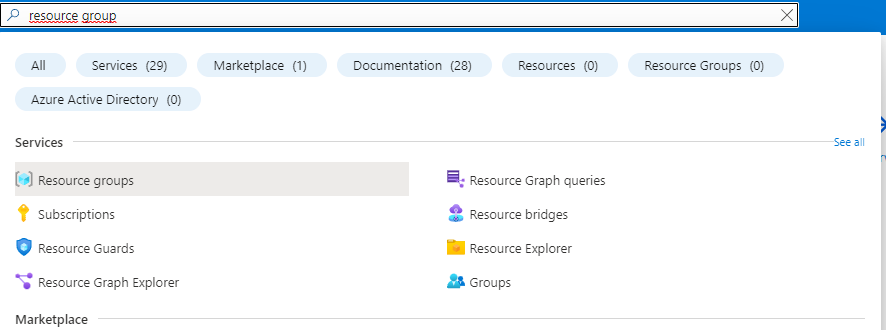

Varmista, että subscription kohdassa lukee Digitalents. Valitse nimi ja sijainniksi North Europe.

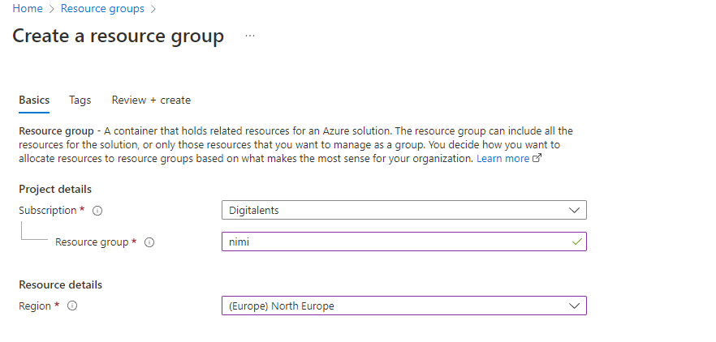

Anna resurssi ryhmällesi 4 tagia.
- luonut: etu ja sukunimi
- käyttäjä: etu ja sukunimi
- tiimi: kohdetiimi
- luotu kk.vvvv
  
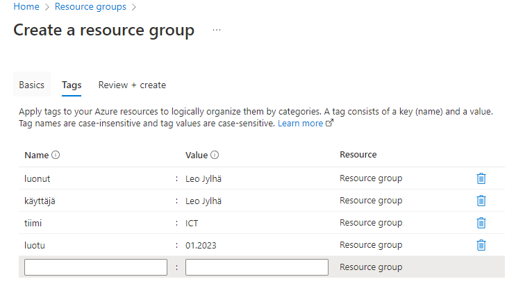

Valitse Review + create.

## 4.2 App Service Plan

Kirjoita hakukenttään "App service plan" ja valitse ensimmäinen. Paina Create.

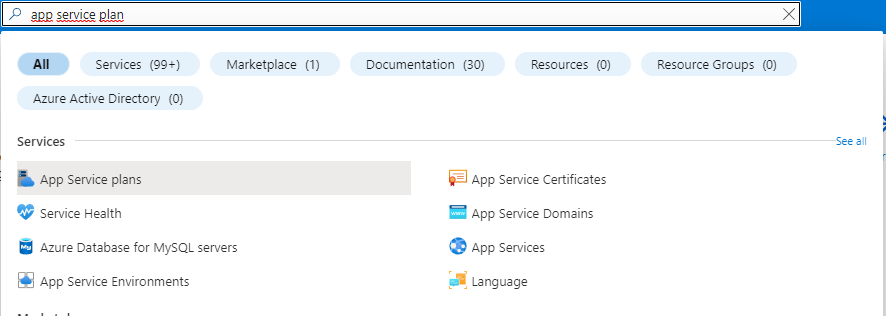

Aseta seuraavat tiedot:

- Subscription: Digitalents
- Resource Group: Tekemäsi resurssiryhmän nimi
- Name: App Service Planin nimi
- Operating System: Linux
- Region: North Europe
- Pricing plan: Free F1/Basic B1, riippuen sovelluksen koosta ja vaativuudesta.
  
  Valitse Review + Create

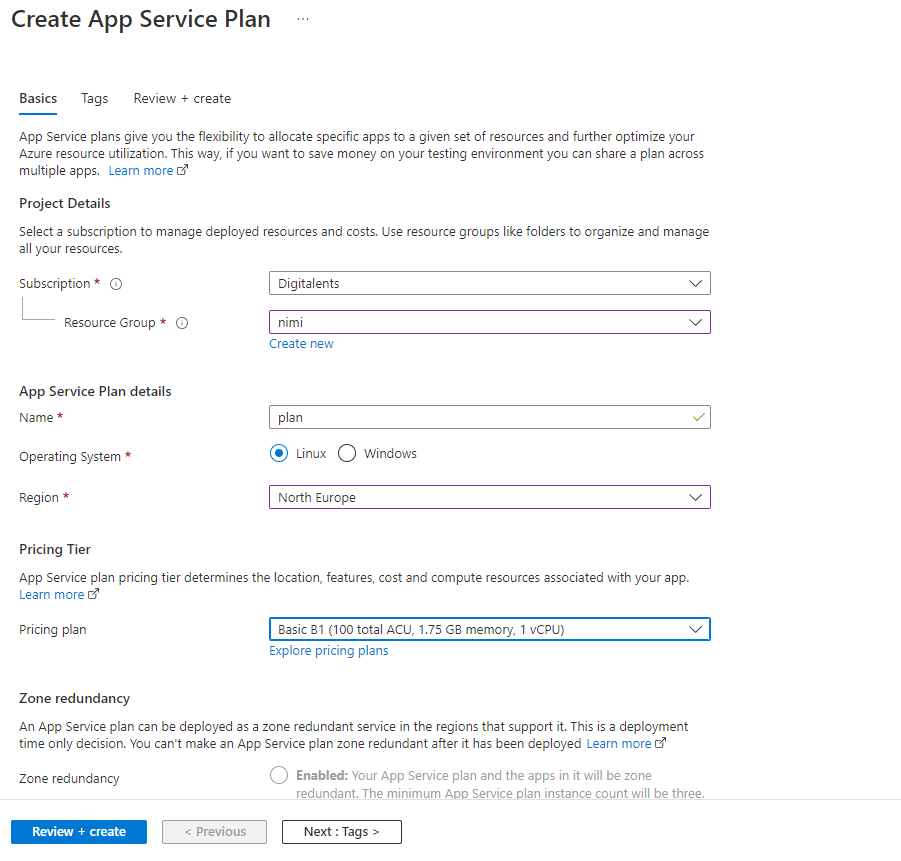

## 4.3 Web App

Kirjoita hakukenttään "App services" ja valitse ensimmäinen. Valitse Create.

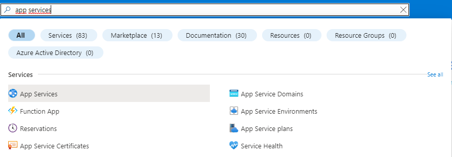

Aseta seuraavat tiedot:

- Subscription: Digitalents
- Resource Group: Tekemäsi resurssiryhmän nimi
- Name: Web sovelluksesi nimi
- Publish: Docker Container
- Operating System: Linux
- Region: North Europe
- Linux Plan: Tekemäsi planin nimi
  
  Valitse Next: Docker
  

Aseta seuraavat tiedot:

- Options: Single Container
- Image Source: Azure Container Registry
- Registry: virittamo
- Image: imagesi nimi
- Tag: latest
  
Valitse Review + Create
  
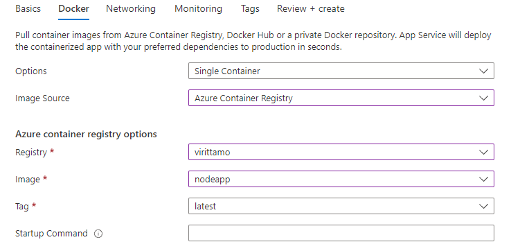

## 5. Logs

Valitse Deployment Center ja view logs.

Tämä kertoo yksityiskohtaista tietoa sovelluksen käynnistymisestä ja vikojen ilmaantuessa myös niistä.

**Huom!**

Sovelluksen käynnistyminen kestää yleensä 2-5 min, joten ole kärsivällinen.

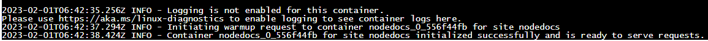

Kun sovellus toimii, se antaa ylläolevan ilmoituksen.

Sovelluksesi osoitteen löydät menemällä Overview -> URL

## 6. Linkit

Tässä dokumentissa sovelluksen toimittaminen ja pystyttäminen on tehty mahdollisimman
simppelillä tavalla.

Erilaisten sovelluksien toimittamisessa ja palvelimien pystyttämisessä voi
ilmetä eroavaisuuksia. 

Tässä olennaisia linkkejä tähän ohjeeseen liittyen:

[App service docs](https://learn.microsoft.com/en-us/azure/app-service/)

[Docker docs](https://docs.docker.com/)

[Vscode docs](https://code.visualstudio.com/docs/azure/deployment)
